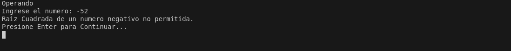

# Calculator Project

Proyecto de una calculadora basada en consola implementada en Java, suporta varias operaciones matematicas, y es de facil uso e intuitiva para el usuario.

## Caracteristicas

- Suma
- Resta
- Multiplicacion
- Division (Manejo de error al dividir por cero)
- Raiz Cuadrada (Manejo de error de input, validacion)
- Potencia 

## Estructura del Proyecto

```
calculator-project
├── src
│   ├── main
│   │   ├── java
│   │   │   ├── com
│   │   │   │   └── calculator
│   │   │   │       ├── Calculator.java
│   │   │   │       ├── CalculatorApp.java
│   │   │   │       ├── Numero.java
│   │   │   │       ├── Operacion.java
│   │   │   │       └── exceptions
│   │   │   │           └── CalculatorException.java
│   │   └── resources
│   └── test
│       ├── java
│       │   ├── com
│       │   │   └── calculator
│       │   │       └── CalculatorTest.java
│       └── resources
├── .gitignore
├── build.gradle
└── README.md
```

## Setup Instructions

1. Clone el repositorio:
   ```
   git clone <repository-url>
   ```
2. Navegar al directorio del proyecto:
   ```
   cd calculator-project
   ```
3. Build the project using Java:
   ```
   javac -d out/production/classes src/main/java/com/calculator/*.java src/main/java/com/calculator/exceptions/*.java

   mkdir -p build/libs

   jar cvf build/libs/calculator-project.jar -C out/production/classes .

   ```

## Uso

Para Correr la aplicacion calculadora ejecutar el comando:
```
java -cp build/libs/calculator-project.jar com.calculator.CalculatorApp
```

Follow the prompts to perform calculations.

## Manejo de Excepciones

La aplicacion incluye manejo de execptiones para operaciones invalidas como lo son:
- Division por cero
- Formato de Inputs invalidos

## Clases

### Clase `Calculadora`

La clase `Calculadora` contiene la lógica para realizar las operaciones aritméticas. Incluye métodos para sumar, restar, multiplicar, dividir, calcular la raíz cuadrada y elevar a una potencia.

### Clase `CalculadoraApp`

La clase `CalculadoraApp` contiene la lógica para la interfaz de usuario. Gestiona la entrada del usuario, muestra los resultados y maneja el flujo de la aplicación.

### Clase `Numero`

La clase `Numero` representa un número real. Tiene un atributo `valor` que almacena el valor del número y métodos para obtener y establecer este valor.

### Clase `Operacion`

La clase `Operacion` representa una operación aritmética específica. Contiene el tipo de operación (suma, resta, multiplicación, división, potencia, raíz cuadrada) y los números involucrados en la operación. Utiliza la clase `Calculadora` para ejecutar la operación.


## Capturas de Pantalla

### Ejemplo de Uso

Tests se han hecho manualmente, para el alcance de la tarea.

Se muestra el menu de la aplicacion


El resultado de una operacion


Manejando diferentes excepciones


